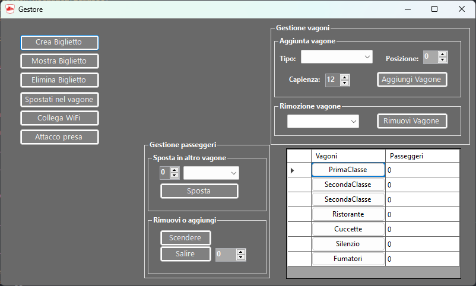

Progetto Treno
===============
Il programma simula la gestione di un treno, permettendo all' utente di gestire un treno, ma anche di comprare i biglietti per esso.
## Abstract iniziale
#### L'abstract iniziale prevedeva la seguente struttura:  
Tipi di vagone(letto,1a 2a 3a classe, silenzio, ristorante);  
Cambio posto, salita, discesa;  
Biglietteria;  
Tabellone arrivi/partenze;  
Carta per caricare biglietti e riscattare punti per viaggi gratis o sconti su viaggi;    
2 form: simulazione del passeggero(salita, discesa, cambio posto), gestione del treno in cui si può vedere lo stato dei vagoni.  

Durante la creazione del progetto ci siamo accorti della presenza di alcune funzioni che avrebbero richiesto troppo lavoro o che non avrebbero contribuito al progetto finale, 
ad esempio la carta per i punti avrebbe richiesto il salvataggio dei dati su un file esterno. In corso d'opera abbiamo aggiunto diverse idee non presenti inizialmente, come ad esempio la gestione dei vagoni e dei suoi passeggeri.
## Funzioni principali

* Crea biglietto
* func 2
* ecc

## Autori
* Carteni Riccardo
* Dal Pont Giona
* Pirozzolo Cristian
* Spinellino Michael
