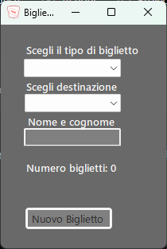

Progetto Treno
===============
Il programma simula la gestione di un treno, permettendo all'utente di gestire un treno, ma anche di comprare i biglietti per esso.

Abstract iniziale
-----------------
### L'abstract prevedeva la seguente struttura:

*Tipi di vagone (letto, 1a 2a 3a classe, silenzio, ristorante);  
Cambio posto, salita, discesa;  
Biglietteria;  
Tabellone arrivi/partenze;  
Carta per caricare biglietti e riscattare punti per viaggi gratis o sconti su viaggi;    
2 form: simulazione del passeggero(salita, discesa, cambio posto), gestione del treno in cui si può vedere lo stato dei vagoni.*  

Durante la creazione del progetto ci siamo accorti della presenza di alcune funzioni che avrebbero richiesto troppo lavoro o che non avrebbero contribuito al progetto finale, 
(ad esempio la carta per i punti avrebbe richiesto il salvataggio dei dati su un file esterno) abbiamo quindi deciso di eliminarle. In corso d'opera abbiamo aggiunto diverse idee non presenti inizialmente, come ad esempio la gestione dei vagoni e dei suoi passeggeri.

Funzioni principali
-------------------

## Sezione utente (Parte sinistra)
* #### Crea biglietto:  
  
Tipi biglietto:  
* Prima classe: permette di accedere ai vagoni di tipo prima classe, fumatori, ristorante e silenzio.
* Seconda classe: permette di accedere ai vagoni di tipo seconda classe e fumatori.
* Full optional: permette di accedere ai vagoni di tipo cuccette, fumatori, ristorante e silenzio.

**Destinazione**: permette di scegliere una destinazione tra le regioni d'Italia.  
**Nome e cognome**: permette di inserire le generalità del passeggero.  

*Dopo aver creato un biglietto non è più possibile modificare tipo e destinazione fino a quando non verranno eliminati i biglietti precedenti.*  
* Mostra biglietto: visualizza le informazioni sui biglietti acquistati.
* Elimina biglietto: elimina tutti i biglietti precedentemente acquistati.
* Spostati nel vagone: permette di spostarsi nel vagone selezionato nella lista in basso a destra (*In base al tipo di biglietto acquistato*). 
* Collega WiFi: verifica se è possibile collegarsi al WiFi nel vagone corrente. *I vagoni che si posso collegare sono di tipo prima classe, cuccette e silenzio.*
* Attacco presa: verifica se è possibile utilizzare le prese elettriche nel vagone corrente. *I vagoni con le prese sono di tipo prima classe, seconda classe e cuccette.*

## Sezione treno (Parte destra)
### Gestione vagoni
* Aggiunta vagone: permette di aggiungere un nuovo vagone.
  1. Selezionare il tipo dalla lista drop-down;
  2. Selezionare la posizione nel treno e la capienza;
  3. Premere su "Aggiungi vagone".
* Rimuovi vagone: permette di eliminare il vagone selezionato nella lista drop-down.

### Gestione passeggeri
* Sposta in altro vagone: permette di spostare dei passeggeri da un vagone a un altro.
  1. Selezionare nella tabella in vagone da dove si vogliono spostare i passeggeri;
  2. Selezionare la quantità di passeggeri da spostare;
  3. Selezionare il vagone nel quale spostare i passeggeri;
  4. Premere su "Sposta".
* Rimuovi o aggiungi: permette di far scendere o salire delle persone nel vagone selezionato nella tabella.  
*Solo i vagoni di tipo prima classe e seconda classe permettono di far salire o scendere dei passeggeri*
*Nel caso si provi a far scendere più persone di quelle presenti nel vagone, il numero di passeggeri andrà di default a 0.*

Autori
------
Nello sviluppo non c'è stata una vera e propria suddivisione del lavoro, ognuno lavorava in base alle necessità del momento. Abbiamo lavorato utilizzando GitHub per avere in cloud sempre l'ultima versione del progetto, quando lavoravamo in più persone contemporaneamente utilizzavamo l'estensione "Live Share" per Visual Studio 2022.  
**Ambiente di sviluppo:** Visual Studio 2022, .NET8.0, Windows 10/11.

* Carteni Riccardo
* Dal Pont Giona
* Pirozzolo Cristian
* Spinellino Michael

### Considerazioni finali
Per noi questo progetto è stato molto formativo, soprattutto nell'ambito della OOP. La fase iniziale di progettazione e preparazione è stata la più difficile, sia per le idee differenti che per i vari problemi tecnici.
